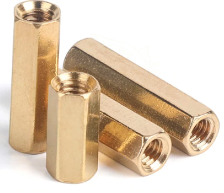
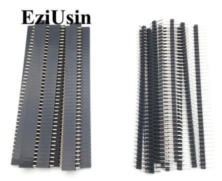
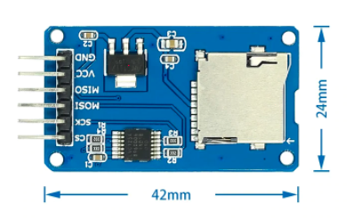
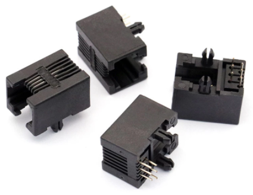

# Hardware Component Choices and Assembly

[Interactive Bill of Materials (BOM)](ibom.html)

### LCD and Mounting

Any old HD44780 1602 LCD from Aliexpress/eBay for ~$2.  You do not need the I2C module, LCD is connected in 4bit parallel mode. For the stand-off mounts you need [11mm M2.5 spacers](https://www.aliexpress.com/item/1005001478740318.html) and screws (same as used mount a Raspberry Pi hat)

 

and a 16 pin (16p) female header.  I buy the  [40 pin packs](https://www.aliexpress.com/item/32724478308.html) and cut them down.

### Micro SD Card Connector

This is the common push-push [Micro SD module](https://www.aliexpress.com/item/1873549637.html) with level shifters.  Sometimes it may say "Catalex" (maybe the original designer?) on the back of the PCB.  You will need to remove the pre-soldered right angle header they all seem to come with so you can mount it upside down on the ADE shield board.

### RJ12 Connector

The "longer" type RJ12 connector from [Aliexpress](https://www.aliexpress.com/item/32865986654.html) work fine if you don't want to spring for the official [Amphenol](https://www.digikey.com/en/products/detail/amphenol-icc-fci/54601-906WPLF/4242891) version.  Remember, ADAMnet takes a RJ12 reverse cable, I get mine at [Monoprice](https://www.monoprice.com/product?p_id=939)

### Bulk Capacitors

C1 is a bulk storage capacitor for the 5V rail.  It is optional since the Arduino already has caps on-board, but if you have a marginal ADAMnet 5V line or experience other power issues, they could help stabilize the overall board.  Any value between 10uf to 47uf is fine.

### Resistors

Either 1/4W or 1/8W can be used in all locations.

R3 controls the activity LED brightness. The value listed is based on John Lundy's original shield design he published, but you may want to pick other values if using different LED's with different [Vf](https://electronics.stackexchange.com/questions/173468/easy-way-to-figure-out-a-leds-vf-in-order-to-pick-an-appropriate-resistor) values or prefer brighter or dimmer LEDs.  I generally shoot for around 1ma to 2ma of current on a standard 20ma LED depending on color. A good calculator is at:

[http://ledcalc.com/](http://ledcalc.com/)

R4 is for the LCD backlighting.  Some came without current limiting resistors on-board and needed an external.  [Inspect yours to see](https://electronics.stackexchange.com/questions/212197/is-it-necessary-to-use-resistor-when-connecting-backlight-of-16x2-lcd-display).  Even on ones that have a 100R resistor, I like to add another 100R here to cut down the brightness a bit.

### Arduino Pin Headers

The BOM shows stacking Arudino socket strip headers since that's what was in the Kicad Mega shield template, but since you are not going to stack anything on this shield, just use the standard [2.54mm male pin headers](https://www.aliexpress.com/item/32724478308.html) you see everywhere.  You can even use two 1x18 strips instead of a 2x18 for the end connector on the Mega.

 

